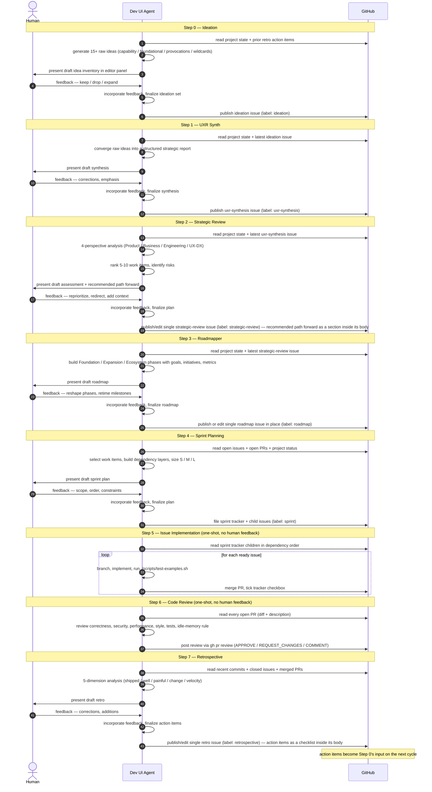

# freq-ai

A Dioxus desktop app and CLI that drives the full development lifecycle for distributed systems through AI coding agents. It replaces the manual coordination between stakeholders, engineers, and reviewers with a four-step loop you can run from a single UI or CLI.

## Install

```sh
curl -fsSL https://raw.githubusercontent.com/geoffsee/freq-ai/master/install.sh | bash
```

This detects your OS and architecture, downloads the latest release binary, and installs it to `~/.local/bin`. Override the install directory with `FREQ_AI_INSTALL_DIR`:

```sh
FREQ_AI_INSTALL_DIR=/usr/local/bin curl -fsSL https://raw.githubusercontent.com/geoffsee/freq-ai/master/install.sh | bash
```

Pre-built binaries are available for:
- Linux x86_64 / aarch64
- macOS aarch64 (Apple Silicon)
- Windows x86_64

### Prerequisites

- `gh` CLI authenticated (`gh auth login`)
- An AI agent on PATH (`claude`, `cline`, `codex`, `copilot`, `gemini`, `grok`, `junie`, or `xai`)

## Quick Start

```sh
freq-ai gui
```

This opens the desktop app. Everything runs from the sidebar.

### CLI Usage

```sh
# Run sprint planning draft
freq-ai sprint-planning

# Fix review comments on a PR
freq-ai fix-pr 123

# Run a specific issue
freq-ai issue 45
```

## How to Progress the Project

The dev agent works in a cycle. Each step feeds into the next. Start at whichever step makes sense for where you are.



**Reading the diagram.** Three lanes — **Human**, **Dev UI Agent**, and **GitHub**. Time runs top-to-bottom; each numbered step is one full cycle of the corresponding sidebar action.

For every step you can read, in order:

1. **What it reads from GitHub** (`A→G: read …`) — the artifact dependency. Every consumer fetches its upstream artifact by canonical label, never by file path or title search.
2. **What it does internally** (`A→A: …`) — the actual transformation: generate, converge, analyse, plan, implement, review. This is the "what is being done" line.
3. **What it asks of you** (`A→H: present draft …`) — only the six two-phase "thinking" steps have this.
4. **The feedback you give** (`H→A: feedback — …`) — typical kinds of feedback for that step.
5. **How the feedback is weighed** (`A→A: incorporate feedback, finalize …`) — the agent re-runs with your feedback as input and produces a new finalized artifact, not a rubber-stamped draft. This is the explicit "weighing" step.
6. **What it publishes back to GitHub** (`A→G: publish / file …`) — the downstream artifact, with its canonical label.

**One-shot vs thinking steps:** Steps 5 (Issue Implementation) and 6 (Code Review) have no `H→A` messages at all — they run end-to-end without pausing for review. Every other step pauses for human feedback and folds it into the final artifact.

**Closing the loop:** Step 7's retro action item issues become Step 0's input on the next pass, so the cycle is self-feeding.

Refresh Docs and Refresh Agents are not on this diagram because they are out-of-loop hygiene actions, not lifecycle steps; see the **Documentation Refresh Actions** section below for their own contract.

### A worked example: one ideal pass through the cycle

The sequence diagram above is abstract — it tells you what the *shape* of every step is. The flowchart below makes that shape concrete by walking one fictional **Edge Node Observability** feature through all eight steps. Every artifact node (parallelogram) holds the kind of content that step actually publishes, and every step→artifact edge label shows the human feedback that shaped that output. The point is to make it visible how each piece of human input changes what the next step sees, and how the loop closes when the retrospective's action items become the seed for the next cycle's ideation.

```mermaid
flowchart TD
    A0[/"Prior cycle retro action item: Edge nodes are invisible in prod — no traces, no metrics, no idea what's happening"/]
    A0 --> S0(["Step 0 · Ideation"])
    S0 -- "Human: keep OTel traces, Prometheus metrics,<br/>structured logs. Drop gossip aggregation,<br/>custom binary wire protocol." --> A1
    A1[/"ideation issue: Edge Node Observability — 5 surviving ideas across the 4 buckets after human review"/]

    A1 --> S1(["Step 1 · UXR Synth"])
    S1 -- "Human: defer logs to phase 2,<br/>focus on traces + metrics first" --> A2
    A2[/"uxr-synthesis issue: OTel + Prometheus is the convergent path. Logs deferred — instrumentation lift is cheaper if traces land first."/]

    A2 --> S2(["Step 2 · Strategic Review"])
    S2 -- "Human: idle memory budget<br/>is the real risk — flag it explicitly,<br/>not as an afterthought" --> A3
    A3[/"strategic-review issue (single, edited in place): Recommended Path Forward — OTel SDK integration · span instrumentation · Prometheus exporter · Grafana dashboard, each as a body section, not a child issue. Risk: ~2 MB idle memory hit from SDK."/]

    A3 --> S3(["Step 3 · Roadmapper"])
    S3 -- "Human: collapse to 2 phases, not 3 —<br/>we don't have visibility past the next sprint" --> A4
    A4[/"roadmap issue (single, edited in place): Phase 1 — OTel SDK + spans. Phase 2 — Prometheus exporter + Grafana dashboard. Success metric: every component hop has a span, memory usage stays within budget."/]

    A4 --> S4(["Step 4 · Sprint Planning"])
    S4 -- "Human: cut span instrumentation to S,<br/>drop the dashboard from this sprint —<br/>land it next cycle once spans are stable" --> A5
    A5[/"sprint tracker + 3 child issues: Layer 0 — OTel SDK integration (M) · Layer 1 — span instrumentation (S) · Layer 2 — Prometheus exporter (M)"/]

    A5 --> S5["Step 5 · Issue Implementation"]
    S5 --> A6
    A6[/"3 merged PRs on agent branches · sprint tracker checkboxes ticked · ./scripts/test-examples.sh green on each merge"/]

    A6 --> S6["Step 6 · Code Review"]
    S6 --> A7
    A7[/"3 PR reviews: 2 APPROVE · 1 REQUEST_CHANGES on the OTel SDK PR — idle memory crept to 11 MB, must tighten downsampling defaults before re-review"/]

    A7 --> S7(["Step 7 · Retrospective"])
    S7 -- "Human: tracker hygiene was great this cycle.<br/>Span PR review was slow because the test matrix<br/>doubled — flag the test budget." --> A8
    A8[/"single retro issue (label: retrospective) with action item checklist: '[ ] Tighten OTel sampling defaults so idle memory stays under budget · [ ] Document Grafana dashboard provisioning before next sprint picks it up'"/]

    A8 -. seeds the next cycle's Step 0 input .-> A0
```



**What to notice in this example.** Look at how the human's Step 2 comment (`idle memory budget is the real risk — flag it explicitly`) propagates downstream: it shows up as the explicit risk note inside the single strategic-review issue (A3), which the Roadmapper carries forward as a success metric in A4 (`memory usage stays within budget`), which Sprint Planning honors by sizing spans down to S in A5, which Code Review then enforces in A7 by requesting changes on the SDK PR for crossing the memory limit, which the Retrospective in A8 echoes back as a concrete action item for the next cycle's defaults. One sentence of human input at Step 2 shaped four downstream artifacts and one PR verdict — that is what "feedback weighed across the chain" looks like in practice.

### Step 0: Ideation

Click **Ideation** in the ACTIONS section.

**Draft phase** -- The agent reads the full project state and generates a wide, varied set of raw ideas across four buckets:

- **Capability ideas** — features users would notice
- **Foundational ideas** — infrastructure, refactors, dev-experience improvements
- **Provocations** — contrarian or uncomfortable ideas that challenge assumptions
- **Wildcards** — half-formed hypotheses, analogies from other systems

The goal is quantity and variety, not quality. At least 15 ideas, unranked and unfiltered.

**Feedback phase** -- Review the ideas and provide your reactions:

- Keep specific ideas ("keep 1, 3, 7")
- Drop others ("drop the database rewrite idea")
- Expand on promising threads ("tell me more about the event-driven approach")
- Add your own ("also consider a plugin system")

Click **Submit & Finalise**. The agent incorporates your feedback and publishes the final ideation set as a GitHub issue labelled `ideation`. This issue becomes input for UXR Synth.

### Step 1: UXR Synth

Click **UXR Synth** in the ACTIONS section.

**Draft phase** -- The agent reads the full project state, the most recent `ideation` issue (if one exists), and `.agents/skills/user-personas/SKILL.md`. It uses the adopter personas as a synthesis lens: tag evidence to the closest persona via `recognition_cues:`, weight findings against that persona's jobs and pains, and treat unmatched signal as a blind spot instead of forcing a weak fit.

**Feedback phase** -- Same flow as before. Review the report, provide corrections and emphasis adjustments.

Click **Submit & Finalise**. The agent publishes the synthesis as a GitHub issue labelled `uxr-synthesis`, keeping the dominant persona signal and any missing-persona blind spots visible in the final briefing.

### Step 2: Strategic Review

Click **Strategic Review** in the ACTIONS section.

**Draft phase** -- The agent reads the full project state (open issues, open PRs, recent commits, STATUS.md, ISSUES.md, crate layout) and analyses it from four perspectives:

- **Product Stakeholder** -- what capabilities are missing, what would unlock adoption
- **Business Analyst** -- untracked requirements, missing user stories, acceptance criteria gaps
- **Lead Engineer** -- tech debt, architectural risks, stale PRs, what "future enhancements" are now urgent
- **UX/DX Researcher** -- first-deploy friction, CLI ergonomics, error messages, documentation gaps

It outputs a unified assessment, a prioritised list of 5-10 work items (with sizing), and risk watch items. No issues are created yet.

**Feedback phase** -- A FEEDBACK section appears in the sidebar with a text area. Review the draft in the editor panel and provide your input:

- Reprioritise ("move observability above load balancing")
- Redirect ("we don't need OIDC yet, focus on DX instead")
- Add context ("the customer demo is May 15, ship the CLI polish first")
- Remove items ("drop the Redis compat work for now")
- Ask for more depth ("expand on the storage replication risk")

Click **Submit & Finalise**. The agent incorporates your feedback and publishes the strategic review as **exactly one** GitHub issue labelled `strategic-review` — a single living strategic-direction artifact. On subsequent runs the same issue is edited in place rather than producing a new one. The recommended path forward lives as a section inside that one issue body, never as separate trackable tickets, so the strategic review does not percolate into sprint planning as discrete work. Sprint Planning is the workflow that turns the recommended items it picks into trackable sprint issues.

### Step 3: Roadmapper

Click **Roadmapper** in the ACTIONS section.

**Draft phase** -- The agent reads the latest open `strategic-review` issue plus the full project state and produces a long-term roadmap draft organised by phase: Foundation (next 1-2 sprints), Expansion (next 2-4 sprints), and Ecosystem (future). Each phase includes goals, 3-5 high-level initiatives, and success metrics. No GitHub issues are created yet.

**Feedback phase** -- Review the draft in the editor panel and provide your input:

- Reshape the phases ("collapse Phase 2 and 3, we don't have visibility that far out")
- Adjust initiatives ("drop the multi-region work, replace with edge caching")
- Re-time milestones ("Foundation should be one sprint, not two")
- Add or remove success metrics

Click **Submit & Finalise**. The agent publishes the roadmap as **exactly one** GitHub issue labelled `roadmap` — a single living "common operating picture" for management forecasting. On subsequent runs the same issue is edited in place rather than producing a new one. Phases and initiatives live as sections inside that one issue body, never as separate trackable work items, so the roadmap does not percolate into sprint planning as discrete tickets.

### Step 4: Sprint Planning

Click **Sprint Planning**.

**Draft phase** -- The agent reads open issues (including the ones just created), open PRs, and project status. It produces a draft sprint plan: grouped work items, dependency order, rough sizing (S/M/L), and any PRs that should merge first.

**Feedback phase** -- Same flow. Review the draft, provide feedback:

- Adjust scope ("too many items, cut it to 5")
- Reorder ("the cache work should come before the edge refactor")
- Add constraints ("I'm out next week, keep it light")
- Split or merge items

Click **Submit & Finalise**. The agent incorporates your feedback and creates a GitHub tracker issue with the final sprint plan as a checkbox list.

### Step 5: Issue Implementation

1. Click **Find Tracker** in the TRACKER section to locate the tracker issue (a GitHub issue with "Tracker" in the title).
2. Click **Refresh** to load the pending issues and their dependencies. They appear in the ISSUES tree -- green dot means ready, red means blocked.
3. Click **Start**.

The agent works through ready issues one at a time in dependency order. For each issue it:

1. Creates a feature branch (`agent/issue-N`)
2. Reads the issue body and builds a context-aware prompt
3. Runs the AI agent to implement the changes
4. Runs `./scripts/test-examples.sh`
5. Commits and merges back to master
6. Checks off the issue in the tracker

This continues until no more issues are ready. Watch progress in the editor panel.

### Step 6: Code Review

Click **Code Review**.

The agent fetches every open PR, pulls the diff and description, and reviews each one for:

- Correctness and logic errors
- Security (OWASP top 10, unsafe code, injection, path traversal)
- Performance (unnecessary allocations, blocking in async, algorithmic complexity)
- Style (project conventions from `.agents/skills/`)
- Test coverage and edge cases
- Performance and resource usage (e.g. memory limits)

It posts the review directly to the PR as a single `gh api` REST call to `POST /repos/{owner}/{repo}/pulls/{n}/reviews` — verdict (APPROVE, REQUEST_CHANGES, or COMMENT) plus line-anchored inline comments for each finding, submitted atomically. `gh pr review` is not used because it cannot attach line-anchored comments.

### Step 7: Retrospective

Click **Retrospective**.

**Draft phase** -- The agent gathers what happened this cycle: recent commits, closed issues, merged PRs, plus what's still open. It analyses five dimensions:

- **What shipped** -- features and fixes that landed, sprint goals met or missed
- **What went well** -- patterns, tools, or approaches worth repeating
- **What was painful** -- process breakdowns, flaky tests, merge conflicts, unclear requirements
- **What to change** -- concrete process improvements for the next cycle
- **Velocity & health** -- throughput, backlog trends, tech debt trajectory

**Feedback phase** -- Review the draft and add your own observations:

- Correct misreadings ("the deploy delay wasn't a blocker, it was intentional")
- Highlight what the agent missed ("onboarding a new contributor was harder than expected")
- Weigh in on recommendations ("yes, invest in better error messages; no, don't restructure the CLI yet")

Click **Submit & Finalise**. The agent incorporates your feedback and publishes the retrospective as **exactly one** GitHub issue labelled `retrospective` — a single living retro artifact for the cycle. On subsequent runs the same issue is edited in place rather than producing a new one. Action items live as a checklist (`- [ ] ...`) inside that one issue body, never as separate trackable tickets, so the retro does not percolate into sprint planning as discrete work. These action items feed directly into the next strategic review.

### Repeat

After the retrospective, go back to Step 0. The ideation phase picks up the retro action items as context and generates fresh ideas. UXR Synth then converges those ideas into structured analysis, and the cycle continues. Each pass tightens the feedback loop.

## Documentation Refresh Actions

Outside the lifecycle loop, two one-shot hygiene actions keep the project's written record in sync with the actual code. They are **strictly disjoint by scope** so they cannot fight each other.

| Action | Scope | Reads as ground truth | Never edits |
|---|---|---|---|
| **Refresh Docs** (sidebar button) | `README.md`, `STATUS.md`, `ISSUES.md`, and every `*.md` file under `docs/` | The current repo: crate layout, shipped workflows, tracker state | `AGENTS.md`, `.agents/skills/**`, `CLAUDE.md`, `CLINE.md`, `GEMINI.md`, `COPILOT.md`, `GROK.md`, `JUNIE.md`, `XAI.md`, source code, tests, manifests |
| **Refresh Agents** (sidebar button) | `AGENTS.md` and every `.agents/skills/*/SKILL.md`, plus optional vendor files (`CLAUDE.md`, `CLINE.md`, `GEMINI.md`, `COPILOT.md`, `GROK.md`, `JUNIE.md`, `XAI.md`) | The current repo: actual file paths, scripts, ops, macros, crate names | `README.md`, `STATUS.md`, `ISSUES.md`, `docs/**`, source code, tests, manifests |

Each action enumerates its in-scope file set, runs the agent against a prompt that forbids touching out-of-scope files, then opens a PR scoped to its own file set. No-op runs (no drift detected) exit cleanly without opening a PR. Both support `--dry-run`.

**Sequencing:** when both need to run, prefer **Refresh Docs first**. Project docs are what contributors read first, so getting them accurate before refreshing the agent-facing instructions ensures the human-facing record leads and the agent-facing record follows. If a single change touches both layers, run Refresh Docs, merge it, then run Refresh Agents against the post-merge state.

**Out-of-scope detection:** both actions detect files modified outside their declared scope and surface them as warnings in the editor panel. They will not stage or commit out-of-scope changes — those stay in your working tree for you to handle separately.

## Options

```sh
freq-ai [OPTIONS] [COMMAND]
```

| Flag | Description | Default |
|---|---|---|
| `--agent <name>` | AI agent (`claude`, `cline`, `codex`, `copilot`, `gemini`, `grok`, `junie`, `xai`) | `claude` |
| `--auto` | Unattended mode (skip permission prompts) | off |
| `--dry-run` | Show what would happen without executing | off |

## Tips

- Use **dry-run** first to preview what any action will do before committing to it.
- The **Follow** checkbox in the editor tab auto-scrolls as events stream in. Uncheck it to scroll back through history.
- **Expand All** opens collapsed thinking and tool-result blocks in the event stream.
- Use **Stop** in the Actions panel to request cancellation of the current run. Active agent subprocesses are terminated, and the loop exits cleanly.
- Switch themes from the title bar dropdown. 10 built-in: Tokyo Night, Catppuccin Mocha, Dracula, Nord, Gruvbox Dark, Solarized Dark, One Dark Pro, Rose Pine, Synthwave '84, GitHub Dark.

## Bot Account Setup (Code Review)

The **Code Review** action posts reviews via `gh pr review`. GitHub forbids approving your own PRs, so a separate bot identity is required. Without it, the Code Review button is disabled.

### Option A — GitHub App (recommended)

1. **Create a private GitHub App** in your user/org settings:
   - **Repository permissions**: Contents (read), Pull requests (read & write), Issues (read & write), Metadata (read).
   - No webhook URL or events required.
2. **Install the app** on the target repository.
3. Note the **App ID** and **Installation ID** (visible in the app's settings page under "Installations").
4. **Generate a private key** (PEM) from the app settings and save it:
   ```sh
   mkdir -p ~/.config/freq-cloud
   mv ~/Downloads/<app-name>.pem ~/.config/freq-cloud/dev-ui-bot.pem
   chmod 600 ~/.config/freq-cloud/dev-ui-bot.pem
   ```
5. **Set environment variables** before launching the dev agent:
   ```sh
   export DEV_BOT_APP_ID="123456"
   export DEV_BOT_INSTALLATION_ID="78901234"
   export DEV_BOT_PRIVATE_KEY="$HOME/.config/freq-cloud/dev-ui-bot.pem"
   freq-ai
   ```

The dev-UI mints short-lived installation tokens on demand (cached for 50 minutes) and injects `GH_TOKEN` into the review subprocess. Audit logs show `dev-ui-bot[bot]`.

You can also configure review-bot access in the GUI under `Configuration` and
click `Save Configuration`. Non-secret settings are written to `dev.toml`;
stored GitHub tokens, GitHub App PEM keys, and local inference API keys go
into the OS credential vault instead of plaintext project files.

### Option B — Personal access token (second user)

1. Create a second GitHub user (e.g. `<owner>-bot`), grant write access to the repo.
2. Generate a **fine-grained PAT** with Pull requests (read & write) and Issues (read & write) scopes.
3. Set the token directly:
   ```sh
   export DEV_BOT_TOKEN="github_pat_..."
   freq-ai
   ```
   Or store it in a file and point to it:
   ```sh
   echo "github_pat_..." > ~/.config/freq-cloud/bot-token
   chmod 600 ~/.config/freq-cloud/bot-token
   export DEV_BOT_TOKEN_PATH="$HOME/.config/freq-cloud/bot-token"
   freq-ai
   ```

### Environment Variables

| Variable | Description | Required |
|---|---|---|
| `DEV_BOT_TOKEN` | Direct token (PAT or pre-minted installation token) | One of these |
| `DEV_BOT_TOKEN_PATH` | Path to a file containing the token | must be set |
| `DEV_BOT_APP_ID` | GitHub App ID | Required for |
| `DEV_BOT_INSTALLATION_ID` | Installation ID for the app on this repo | GitHub App mode |
| `DEV_BOT_PRIVATE_KEY` | Path to the App's PEM private key (default: `~/.config/freq-cloud/dev-ui-bot.pem`) | Optional |

## Supported Agents

| Agent | Binary | Auto flag | Event streaming | Notes |
|---|---|---|---|---|
| Claude | `claude` | `--dangerously-skip-permissions` | stream-json | Default. Full structured event streaming to the UI. |
| Cline | `cline` | `--no-interactive` | plain | Multi-provider agent. Configure provider with `cline auth`. |
| Gemini | `gemini` | `--yolo` | stream-json | Full structured event streaming (same parser as Claude). |
| Grok | `grok` | `--sandbox` | json | xAI's grok-cli. Uses `GROK_API_KEY` (falls back to `XAI_API_KEY`). |
| Junie | `junie` | `--brave` | json-stream | JetBrains Junie CLI. BYOK via `--provider` + API key flags. |
| Codex | `codex` | `--dangerously-bypass-approvals-and-sandbox` | JSONL (`exec --json`) | Streams assistant/tool/result events into the same UI timeline. |
| Copilot | `copilot` | `--yolo` | unknown | GitHub Copilot CLI (standalone binary, not `gh copilot`). |
| xAI | `copilot` | `--yolo` | unknown | Proxies the GitHub Copilot CLI with xAI-compatible BYOK settings via environment variables. |

## Project Structure

```
src/
  main.rs              App root, signals, event channel
  agent/
    types.rs           AgentEvent, ClaudeEvent, Config, Workflow
    shell.rs           Agent dispatch, two-phase workflow runners
    tracker.rs         GitHub issue/PR parsing, draft/finalize prompt builders
  ui/
    components.rs      CSS, EventRow, ContentBlockRow
    editor.rs          Editor panel (activity log)
    sidebar.rs         Sidebar (config, actions, feedback, tracker, issues)
    statusbar.rs       Status bar
  custom_themes.rs     Theme definitions
```
